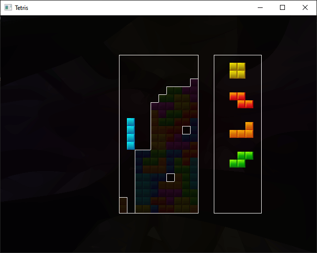

# r97tris

A tetris clone developed by roaming97 taking elements from the [Tetris: The Grandmaster](https://tetris.wiki/Tetris_The_Grand_Master_(series)) series in C using [SDL2](https://www.libsdl.org/), [OpenGL](https://www.opengl.org/) & [BASS](https://www.un4seen.com/).



> [!WARNING]
> This game's development is still in progress, so expect a lot of bugs and [unimplemented features](TODO.md) if you wish to play it at this point in time!

## Controls
```
Move piece                 - Arrow keys
Counterclockwise rotation  -      Z key
Clockwise rotation         -      X key
Restart game               -      R key

Restarting only works when the game has ended.
```
## Assets

> [!IMPORTANT]
> I excluded the `data` folder from this repository for copyright resons, you will need to find assets to use in your own copy of the game or else the game won't load correctly, the assets the game uses hereare:

### Textures
Loads from `data/img`
* background.png
* texturemap.png

### Music
Loads from `data/music`
* \_te-x-mas_6\_.mod

But you may use any track in any of the accepted formats in BASS, make sure to change the filename it loads in the code though!

### Sounds
Loads from `data/sfx`
* SEB_disappear.wav
* SEB_fall.wav
* SEB_fixa.wav
* SEB_instal.wav
* SEB_mino1.wav
* SEB_mino2.wav
* SEB_mino3.wav
* SEB_mino4.wav
* SEB_mino5.wav
* SEB_mino6.wav
* SEB_mino7.wav
* SEB_prerotate.wav

## Building

### Python

> [!IMPORTANT]
> This project requires at least Python **3.6**.

If you want to change the look of the game via the shaders (in the `shaders` folder), you must make sure that the Python script works since the shaders must be compiled into the game before compiling the game itself.

> [!TIP]
> Create a virtual environment then activate it:
> ```
> $ python3 -m venv venv
> ```

Activate on **Unix**
```
$ source venv/bin/activate
```

Activate on **Windows**
```
> .\venv\Scripts\activate
```

Install the script's dependencies:
```
$ pip install -r requirements.txt
```

Make sure the script is working:
```
python3 shader.py
```

If the script runs and compiles the shaders correctly, you're all set!

### C

I compiled this game using TCC using the [build.bat](build.bat) script, but if you wish to use another compiler, you must link the following libraries:

- SDL2
- SDL2Main
- bass

If you are on Windows, be sure to include `bass.dll` and `SDL2.dll` alongside the game's executable.

TODO: For now the script will compile an EXE for Windows. Multitarget Makefile is still pending.
